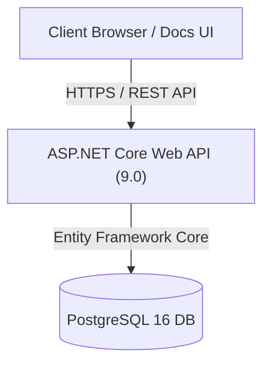

# MythosGraph 🌌

[](https://dotnet.microsoft.com/)
[](https://nextjs.org/)
[](https://www.postgresql.org/)
[](https://www.docker.com/)

An **API-first knowledge graph system** designed to model, query, and traverse structured data about mythology, folklore, legendary artifacts, regions, traditions, and divine pantheons. MythosGraph comes equipped with a specialized **CreatureDex** module for cataloging and searching supernatural beasts, spirits, and monsters.

---

## 🏗️ Architecture Overview

MythosGraph is built on a clean decoupling of the data API layer and the presentation web app.



### 1. Backend: ASP.NET Core 9 Web API
Organized according to **Clean Architecture** principles to separate concerns and ensure maintainability:
*   **[MythosGraph.Domain](file:///d:/Project/Vibbing/mythosgraph/backend/src/MythosGraph.Domain)**: Core domain entities (`GraphEntity`, `GraphRelation`, `Tradition`, `Taxonomy`, `Source`), value objects, enums, and business rules.
*   **[MythosGraph.Application](file:///d:/Project/Vibbing/mythosgraph/backend/src/MythosGraph.Application)**: CQRS Commands and Queries (using MediatR), DTO mappings, and validator rules.
*   **[MythosGraph.Infrastructure](file:///d:/Project/Vibbing/mythosgraph/backend/src/MythosGraph.Infrastructure)**: Data access (EF Core `DbContext`), migrations, repository implementations, and data seeders.
*   **[MythosGraph.Api](file:///d:/Project/Vibbing/mythosgraph/backend/src/MythosGraph.Api)**: REST Controllers, rate limiting, routing configuration, caching, and Swagger/OpenAPI setup.

### 2. Frontend: Next.js Documentation & Dashboard
A interactive web-app designed for both administrators and API consumers:
*   **Framework**: Next.js 15 (App Router) & React 19.
*   **State Management**: React Query (TanStack Query) for declarative caching and server-state synchronization.
*   **Styling & Components**: Tailwind CSS, Radix UI primitives, shadcn/ui component layouts, and Framer Motion transitions.
*   **Visualizations**: Interactive graph traversers, search playgrounds, and a dedicated CreatureDex UI.

---

## ✨ Core Features

*   **Mythology Knowledge Graph**: Model complex relationships between mythological subjects (e.g., `Thor` $\rightarrow$ `wields` $\rightarrow$ `Mjolnir`).
*   **Graph Traversal & Pathfinding**: Find connection paths between any two mythology entities in the graph with configurable traversal depth.
*   **CreatureDex Module**: Special index focusing on supernatural creatures, spirits, and monsters, cataloging danger levels, habitats, abilities, and weaknesses.
*   **Flexible Taxonomy**: Dynamic hierarchical classification (e.g., `Spirit` $\rightarrow$ `Water Spirit` $\rightarrow$ `River Spirit`).
*   **Metadata & Citations**: Track sources, license notes, and bibliography information for every entity and relationship.
*   **Developer API Playground**: A visual, interactive console to test endpoints right from the web dashboard.

---

## 📂 Project Directory Structure

```text
mythosgraph/
├── backend/                       # .NET Core Clean Architecture project
│   ├── src/
│   │   ├── MythosGraph.Domain/     # Core domain entities & definitions
│   │   ├── MythosGraph.Application/ # Business logic & Use Cases (CQRS)
│   │   ├── MythosGraph.Infrastructure/ # Database access & configurations
│   │   └── MythosGraph.Api/         # Web API controllers & startup configurations
│   └── MythosGraph.sln
├── frontend/                      # Next.js Single Page Application
│   ├── app/                       # App Router pages (admin, creatures, docs, graph, etc.)
│   ├── components/                # Reusable UI component blocks
│   ├── lib/                       # API clients and utilities
│   └── package.json
├── docs/                          # Project specifications & documentation
│   └── srs.md                     # Software Requirements Specification (SRS)
├── Dockerfile                     # Multi-stage Docker builder for Backend
├── docker-compose.yml             # Local service conductor (postgres + api container)
├── .env.example                   # Shared template environment variables
└── README.md                      # Project entry guide (this file)
```

---

## 🚀 Getting Started

### Prerequisites

Ensure you have the following installed:
*   [.NET 9.0 SDK](https://dotnet.microsoft.com/download/dotnet/9.0)
*   [Node.js (v18+)](https://nodejs.org/) & `npm`
*   [Docker & Docker Compose](https://www.docker.com/products/docker-desktop/) *(for containerized spin-up)*

---

### Method A: Quickstart via Docker Compose 🐳

1.  **Configure environment variables**:
    Copy the example configuration to a new `.env` file at the root:
    ```bash
    cp .env.example .env
    ```

2.  **Start Services**:
    Run Docker Compose to build the backend and spin up the PostgreSQL database:
    ```bash
    docker compose up --build
    ```
    *   The database will start on port `5432`.
    *   The backend API will start on port `5098`.

3.  **Run the Frontend**:
    In a new terminal window, navigate to the `frontend` folder, install dependencies, and launch:
    ```bash
    cd frontend
    npm install
    npm run dev
    ```
    Open [http://localhost:3000](http://localhost:3000) to view the Web Application dashboard.

---

### Method B: Manual / Local Setup 🛠️

#### 1. Setup the Database
Install PostgreSQL locally, and create a database named `mythosgraph`. Update your connection string in `.env` or `backend/src/MythosGraph.Api/appsettings.json` if your password or username differs.

#### 2. Run the Backend API
Navigate to the API folder, restore dependencies, and start the development server:
```bash
cd backend/src/MythosGraph.Api
dotnet restore
dotnet run
```
*   The API will listen at `http://localhost:5098` (or `https://localhost:7098`).
*   Visit `http://localhost:5098/swagger` to inspect the Swagger UI documentation.

#### 3. Run the Frontend App
Navigate to the `frontend` folder, prepare environment settings, install dependencies, and launch:
```bash
cd frontend
cp .env.example .env
npm install
npm run dev
```
*   The application will run on `http://localhost:3000`.

---

## ⚙️ Configuration Variables

The API expects the following keys in your `.env` or application configuration:

| Variable Name | Description | Default Value |
| :--- | :--- | :--- |
| `ConnectionStrings__DefaultConnection` | EF Core PostgreSQL connection string | `Host=localhost;Database=mythosgraph;Username=postgres;Password=postgres` |
| `Jwt__SecretKey` | JWT signing secret for administration routes | *Generate a secure token for production* |
| `NEXT_PUBLIC_API_URL` | Frontend client-facing API endpoint URL | `http://localhost:5098` |

---

## 📝 Documentations & Specifications

For full functional specifications, endpoint payloads, database model designs, and features breakdown, please refer to the detailed:
*   [Software Requirements Specification (SRS)](file:///d:/Project/Vibbing/mythosgraph/docs/srs.md)
