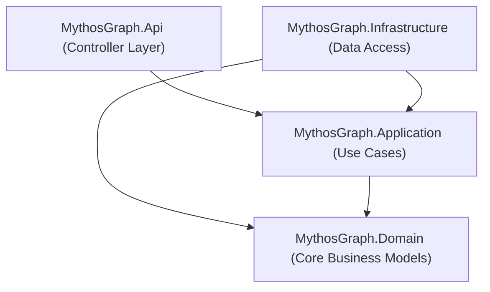

# MythosGraph API Backend 🛡️

[](https://dotnet.microsoft.com/)
[](https://learn.microsoft.com/en-us/ef/core/)
[](https://www.postgresql.org/)
[](https://github.com/jbogard/MediatR)

This is the core backend engine for the **MythosGraph** application. It provides a RESTful web API for querying mythology structures, computing shortest relationship paths within a knowledge graph, and fetching metadata for the **CreatureDex** module.

---

## 🏗️ Architecture Design (Clean Architecture)

The project is structured according to **Clean Architecture** patterns. This enforces a separation of concerns, where business logic does not depend on database frameworks or UI technologies.



### 1. [MythosGraph.Domain](file:///d:/Project/Vibbing/mythosgraph/backend/src/MythosGraph.Domain)
The innermost layer. It has zero external dependencies and holds the enterprise business objects:
*   **Entities**: Core structures like `GraphEntity`, `GraphRelation`, `Tradition`, `Taxonomy`, `Source`, and `AuditLog`.
*   **Enums & Value Objects**: Common classification schemas (e.g. `EntityType`).

### 2. [MythosGraph.Application](file:///d:/Project/Vibbing/mythosgraph/backend/src/MythosGraph.Application)
Contains application-specific business rules and coordinates data flows.
*   **CQRS Pattern**: Driven by `MediatR` to separate read operations (Queries) from write operations (Commands).
*   **Validation**: Uses FluentValidation to enforce input formats before execution.
*   **DTOs**: Lightweight objects designed specifically for serialization over the network.
*   **Interfaces**: Abstractions for repositories and services implemented by the infrastructure layer.

### 3. [MythosGraph.Infrastructure](file:///d:/Project/Vibbing/mythosgraph/backend/src/MythosGraph.Infrastructure)
Implements interfaces defined in the Application layer, providing data access and external integrations.
*   **Persistence**: Holds the EF Core [MythosGraphDbContext.cs](file:///d:/Project/Vibbing/mythosgraph/backend/src/MythosGraph.Infrastructure/Persistence/MythosGraphDbContext.cs) and database Migrations.
*   **Repositories**: Database query logic for Traditions, Entities, Relations, and Taxonomy.
*   **Seeders**: Default database population tools, including the `AdminUserSeeder` for creating administrative logins.

### 4. [MythosGraph.Api](file:///d:/Project/Vibbing/mythosgraph/backend/src/MythosGraph.Api)
The presentation layer, handling HTTP requests and responses.
*   **Controllers**: Map HTTP methods (`GET`, `POST`, `PUT`, `DELETE`) to CQRS commands/queries.
*   **Middlewares**: Exception handling handlers (`ApiExceptionMiddleware`) and security validations.
*   **Swagger Integration**: Automated API playground generation.

---

## ⚙️ Middleware Features

### 1. Output Caching
To ensure optimal public performance, GET requests are cached using ASP.NET Core Output Caching.
*   **Policy**: `PublicApiGet` caches responses for 60 seconds.
*   **VaryByQuery**: Caches are split uniquely per query parameters (`VaryByQuery("*")`).

### 2. Rate Limiting
Built-in rate limiting protects endpoints against denial-of-service attempts:
*   **Public Read Policy**: Maximum 120 calls per minute (IP-based limit).
*   **Auth Routes Policy**: Strict limit of 5 login attempts per minute (IP-based limit).
*   **Admin Write Policy**: Maximum 1,500 operations per 5 minutes (User-based limit).

### 3. Security (JWT Authentication)
*   Routes decorated with `[Authorize]` require a Bearer token in the request header (`Authorization: Bearer {Token}`).
*   Token signatures are checked against the key defined in configuration options.

---

## 🚀 Running the API Locally

### 1. Environment Setup
Configure your environment variables by setting them in your system environment or writing a `.env` file at the repository root. Ensure the connection string points to a valid PostgreSQL server:
```ini
ConnectionStrings__DefaultConnection="Host=localhost;Port=5432;Database=mythosgraph;Username=postgres;Password=postgres;SSL Mode=Prefer;Trust Server Certificate=true"
Jwt__SecretKey="YOUR_JWT_SECRET_KEY_HERE"
```

### 2. Apply Database Migrations
Use the Entity Framework CLI tools to create or update the database schema:
```bash
dotnet ef database update --project src/MythosGraph.Infrastructure --startup-project src/MythosGraph.Api
```

### 3. Run the Development Server
Restore dependencies and execute the API application:
```bash
cd src/MythosGraph.Api
dotnet restore
dotnet run
```
The server will start listening at:
*   `http://localhost:5098`
*   `https://localhost:7098`

Visit `http://localhost:5098` in your browser to explore the interactive **Swagger UI** dashboard.

---

## 🌐 Endpoint Reference

| Route | HTTP Method | Access Level | Description |
| :--- | :--- | :--- | :--- |
| `/api/v1/entities` | `GET` | Public | List all mythology entities with pagination & filters |
| `/api/v1/entities/{slug}` | `GET` | Public | Fetch detailed information for a single entity |
| `/api/v1/entities/{slug}/relations` | `GET` | Public | Retrieve knowledge-graph links for an entity |
| `/api/v1/graph/path` | `GET` | Public | Compute shortest path between two entities |
| `/api/v1/creatures` | `GET` | Public | Catalog query for the CreatureDex module |
| `/api/v1/traditions` | `GET` | Public | List mythologies (Greek, Norse, Vietnamese, etc.) |
| `/api/v1/admin/entities` | `POST`/`PUT`/`DELETE` | Admin | Manage canonical entities |
| `/api/v1/admin/relations` | `POST`/`DELETE` | Admin | Manage graph relationships |
